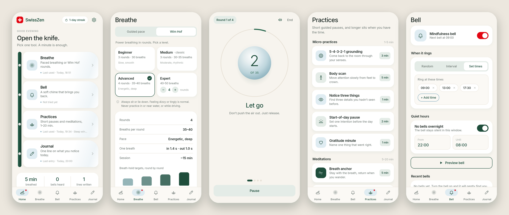

<div align="center">


# SwissZen

### The Mindfulness Multi‑Tool

*One app, five small instruments. Pick the one that fits the moment — a minute is enough.*

[](https://github.com/bigdevwhale/SwissZen/actions/workflows/android.yml)
[](https://github.com/bigdevwhale/SwissZen/releases/latest)


[](LICENSE)

**English** · [Русский](README.ru.md) · [Website](https://bigdevwhale.github.io/stillcraft/apps/swisszen/)



</div>

---

## Why "Swiss Army knife"?

Most mindfulness apps are one big program you have to commit to. SwissZen is the opposite: a pocket knife.
Open it, unfold the one blade you need right now, close it again. The Home screen literally fans the tools
out of a knife handle — and Swiss red is used for exactly one thing on every screen: the action that matters.

## The tools

| | Tool | What it does |
|---|---|---|
| 🫁 | **Breathe · Guided pace** | A calm sphere that grows on the inhale and settles on the exhale. *Box 4‑4‑4‑4*, *Calm 4‑7‑8*, *Coherent 5‑5*; 2 / 5 / 10 minute sessions; pause exactly where you are. |
| ❄️ | **Breathe · Wim Hof** | Guided power‑breathing rounds in the style of the classic guided videos: *fully in — let go*, breath counter, empty‑lungs hold with a stopwatch and per‑round target, 15 s recovery breath, round summary. Four levels (below). |
| 🔔 | **Bell** | A real mindfulness bell that rings while the app is closed: random (15–90 min), fixed interval, or set times of day, with quiet hours. Tap *I paused* on the notification and add a note about what you noticed. |
| 🌿 | **Practices** | Five step‑by‑step micro‑practices (5‑4‑3‑2‑1 grounding, body scan, notice three things, start‑of‑day pause, gratitude minute) and five timed meditations of 5–20 min (breath anchor, loving‑kindness, mountain, walking, sleep wind‑down). |
| ✍️ | **Journal** | One line a day against a rotating prompt. Streak and week view, and an *Echo* — a line you wrote a few weeks ago, resurfaced. |

Home ties it together: today's minutes breathed, bells heard and lines written, your streak, and when you last used each tool.

### Wim Hof levels

| Level | Rounds | Breaths / round | Pace (in / out) | Hold targets |
|---|:---:|:---:|---|---|
| Beginner | 3 | 30 | slow, smooth · 2.0 s / 1.6 s | 0:30 → 1:00 → 1:30 |
| Medium · classic | 3 | 30–35 | moderate, rhythmic · 1.6 s / 1.3 s | 1:00 → 1:30 → 1:30–2:00 |
| Advanced | 4 | 35–40 | energetic, deep · 1.4 s / 1.0 s | 1:00 → 1:30 → 2:00 → 2:30 |
| Expert | 4–5 | 40–50 | intense, fast · 1.1 s / 0.8 s | 1:30 → 2:00 → 2:30 → 3:00+ |

Each round: power breaths → last breath, let it all go → **hold on empty lungs** (open‑ended, you decide when to breathe in) → recovery breath held for 15 s → next round.

> [!WARNING]
> Always practice sitting or lying down. Never in or near water, never while driving.
> Breathing exercises are not medical treatment — if you have a heart condition, epilepsy, are pregnant or unsure, talk to a doctor first.

## English & Русский

Every screen, practice and prompt is translated. Switch in **Settings → Language** (System / English / Русский) — on Android 13+ the app also appears in the system's per‑app language settings.

## Download

Grab the latest APK from **[Releases](https://github.com/bigdevwhale/SwissZen/releases/latest)**, or the debug APK attached to any [CI run](https://github.com/bigdevwhale/SwissZen/actions/workflows/android.yml).
Android 8.0 (API 26) or newer.

## Under the hood

- **Kotlin + Jetpack Compose**, Material 3 with a custom design system (ivory `#F7F4EE`, pine `#1E4D3B`, ice `#DFECF2`, Swiss red `#E30613`, Inter typeface).
- **Room** for journal, bell history and session log · **DataStore** for settings.
- **AlarmManager** (`setAndAllowWhileIdle`, no exact‑alarm permission) + notification channel with a custom chime for the bell; rescheduled on boot and time changes.
- **Synthesised breath audio** — white noise through a sweeping band‑pass filter, rendered with `AudioTrack`, so the sound always matches the level's tempo.
- The Wim Hof session is a pure‑Kotlin state machine (`breath/WimHof.kt`) driven per frame, with unit tests for every level's timing.
- Per‑app language via `AppCompatDelegate.setApplicationLocales` with an auto‑generated locale config.
- No accounts, no network, no analytics. Everything stays on the device.

```
app/src/main/java/app/swisszen/
├── breath/        Wim Hof engine + levels, guided-pace engine (pure Kotlin, unit-tested)
├── bell/          schedule logic (quiet hours), alarms, notification, boot receiver
├── audio/         breath-sound synth + bell chime
├── data/          Room database, DataStore settings
└── ui/            theme, components, home · breathe · bell · practices · journal · settings
```

## Build from source

Requirements: JDK 17+ (Android Studio's bundled JBR works) and the Android SDK.

```bash
git clone https://github.com/bigdevwhale/SwissZen.git
cd SwissZen
./gradlew testDebugUnitTest      # unit tests
./gradlew assembleDebug          # app/build/outputs/apk/debug/app-debug.apk
./gradlew installDebug           # install on a connected device
```

### CI / releases

- **Android CI** (`.github/workflows/android.yml`) — on every push and PR: unit tests, lint (missing translations fail the build), debug APK uploaded as an artifact.
- **Release** (`.github/workflows/release.yml`) — push a tag like `v1.0.0` (or run it manually) to build a signed release APK and publish it as a GitHub Release.

## License

[MIT](LICENSE) · Inter typeface under the SIL Open Font License 1.1.
