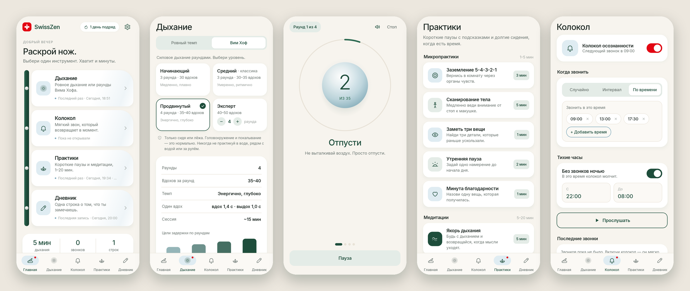

<div align="center">


# SwissZen

### Швейцарский нож для осознанности

*Одно приложение — пять маленьких инструментов. Выбери тот, что подходит моменту. Хватит и минуты.*

[](https://github.com/bigdevwhale/SwissZen/actions/workflows/android.yml)
[](https://github.com/bigdevwhale/SwissZen/releases/latest)


[](LICENSE)

[English](README.md) · **Русский**



</div>

---

## Почему «швейцарский нож»?

Большинство приложений для медитации — это одна большая программа, на которую надо подписаться.
SwissZen — наоборот, карманный нож: открыл, раскрыл нужное лезвие, закрыл. На главном экране инструменты
буквально раскрываются из рукоятки ножа, а швейцарский красный на каждом экране отмечает ровно одно — главное действие.

## Инструменты

| | Инструмент | Что делает |
|---|---|---|
| 🫁 | **Дыхание · ровный темп** | Шар, который растёт на вдохе и опадает на выдохе. *Квадрат 4‑4‑4‑4*, *Покой 4‑7‑8*, *Когерентное 5‑5*; сессии 2 / 5 / 10 минут; пауза замирает ровно на том месте, где нажата. |
| ❄️ | **Дыхание · Вим Хоф** | Силовое дыхание раундами, как в классических видео‑гайдах: «глубокий вдох — отпусти», счётчик вдохов, задержка на пустых лёгких с секундомером и целью раунда, восстанавливающий вдох на 15 с, итоги. Четыре уровня (ниже). |
| 🔔 | **Колокол** | Настоящий колокол осознанности, который звонит и при закрытом приложении: случайно (15–90 мин), с интервалом или в заданное время, с тихими часами. Нажми «Пауза сделана» в уведомлении и запиши, что удалось заметить. |
| 🌿 | **Практики** | Пять пошаговых микропрактик (заземление 5‑4‑3‑2‑1, сканирование тела, заметь три вещи, утренняя пауза, минута благодарности) и пять медитаций по таймеру на 5–20 минут (якорь дыхания, любящая доброта, гора, ходьба, подготовка ко сну). |
| ✍️ | **Дневник** | Одна строка в день на вопрос дня. Серия дней, неделя и «Эхо» — строка, написанная несколько недель назад. |

### Уровни Вима Хофа

| Уровень | Раунды | Вдохов за раунд | Темп (вдох / выдох) | Цели задержки |
|---|:---:|:---:|---|---|
| Начинающий | 3 | 30 | медленно, плавно · 2,0 с / 1,6 с | 0:30 → 1:00 → 1:30 |
| Средний · классика | 3 | 30–35 | умеренно, ритмично · 1,6 с / 1,3 с | 1:00 → 1:30 → 1:30–2:00 |
| Продвинутый | 4 | 35–40 | энергично, глубоко · 1,4 с / 1,0 с | 1:00 → 1:30 → 2:00 → 2:30 |
| Эксперт | 4–5 | 40–50 | интенсивно, быстро · 1,1 с / 0,8 с | 1:30 → 2:00 → 2:30 → 3:00+ |

> [!WARNING]
> Практикуй только сидя или лёжа. Никогда в воде, рядом с водой или за рулём.
> Дыхательные упражнения — не лечение. При проблемах с сердцем, эпилепсии, беременности или сомнениях посоветуйся с врачом.

## Язык

Всё приложение переведено. Переключение: **Настройки → Язык** (Как в системе / English / Русский). На Android 13+ язык можно выбрать и в системных настройках приложения.

## Скачать

Последний APK — в **[Releases](https://github.com/bigdevwhale/SwissZen/releases/latest)**, отладочный APK — в артефактах любого [запуска CI](https://github.com/bigdevwhale/SwissZen/actions/workflows/android.yml). Нужен Android 8.0 или новее.

## Сборка

```bash
git clone https://github.com/bigdevwhale/SwissZen.git
cd SwissZen
./gradlew testDebugUnitTest assembleDebug
```

Подробности о стеке, CI и подписи релизов — в [английском README](README.md#under-the-hood).

## Лицензия

[MIT](LICENSE) · шрифт Inter — SIL Open Font License 1.1.
